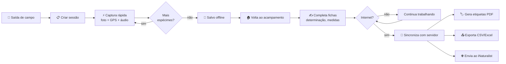

<!-- _class: lead -->
<!-- _paginate: false -->

# 🌿 Folium

## Coleta botânica de campo, offline-first

**v1.9.0** · Para botânicos, herbários e coletores

---

<!-- _footer: 'Folium · Visão geral' -->

# Para quem é o Folium?

### 👩‍🔬 Botânicos & Pesquisadores
Registro de espécimes em expedições, com **GPS, fotos e áudio** mesmo sem sinal.

### 🌱 Coletores de campo
Captura rápida no momento da coleta — em segundos, não minutos.

### 🏛️ Curadores de herbário
Etiquetas padronizadas, exportação para CSV/Excel, integração com **iNaturalist**.

**O problema que resolvemos**

> "Em campo, não há internet. Cadernos se molham. Planilhas no celular são lentas. Fotos perdem o GPS no caminho até o herbário."

Folium é **100% funcional offline** e sincroniza assim que você voltar à área coberta.

---

<!-- _class: section-cover -->

Parte 1

# Primeiros passos

---

# 1. Login & primeiro acesso

### Como começar
1. Abra o app pela primeira vez
2. Veja o **tutorial guiado** (onboarding)
3. Faça login com **e-mail/senha** ou **Google**
4. Não tem conta? Cadastre-se direto no app

### Sem conexão?
- Login **lembra suas credenciais** e funciona offline
- Você só precisa de internet **uma vez** para o primeiro login
- Depois, todos os dados ficam no aparelho

🌿 Folium 9:41

🌿

Bem-vindo

📧 voce@email.com

🔒 ••••••••

Entrar

ou continuar com Google

---

# 2. Tela inicial: seu acervo

### O hub central
A **lista de plantas** é o coração do app:

- 🔍 **Busca rápida** por nome científico, popular, família
- 🏷️ **Filtros** por categoria (árvore, erva, samambaia…)
- ⚡ **Status de sincronização** visível em cada item
- ➕ **Botão flutuante** para nova coleta

### Indicadores de sincronização
- 🟢 sincronizado
- 🟡 pendente
- 🔴 conflito
- ⚪ apenas local

🌿 Acervo 📶 ⚡ 12 pend.

🔍 Buscar planta…

Tibouchina granulosa

Quaresmeira · Melastomataceae

📍 Manaus · 14/05 · 🟢

Caesalpinia ferrea

Pau-ferro · Fabaceae

📍 RPPN Cristalino · 13/05 · 🟡

Dicksonia sellowiana

Xaxim · Dicksoniaceae

📍 Itatiaia · 12/05 · 🟢

---

<!-- _class: section-cover -->

Parte 2

# Fluxo de coleta em campo

---

# 3. Sessão de coleta: o "diário do dia"

### Por que sessões?
Toda saída de campo vira uma **sessão** — agrupa todos os espécimes coletados naquela expedição.

### O que uma sessão contém
- 📅 **Data e horário** de início/fim
- 📍 **Localidade** + bioma detectado
- 👥 **Coletores e identificadores**
- 🌦️ **Clima** + 🌙 **fase da lua** automáticos
- 📝 **Notas livres** da expedição
- 🛣️ **Trilha GPS** opcional (registra o trajeto)

### 💡 Dica
Crie a sessão **antes** de começar a coletar. Cada planta adicionada será automaticamente vinculada — você não precisa repetir localização, data e participantes em cada ficha.

### ⚠️ Modo Chuva
Ativando o **modo chuva**, a interface fica com botões maiores e protege contra toques acidentais.

---

# 4. Captura rápida — a estrela do app

📸

<strong>Foto</strong> 
<small>1 toque EXIF + GPS automáticos</small>

→

📍

<strong>GPS</strong> 
<small>Latitude, longitude, altitude e precisão</small>

 

🎤

<strong>Áudio</strong> 
<small>Grave observações de viva voz</small>

→

✅

<strong>Salvo</strong> 
<small>Tudo no aparelho, sem internet</small>

 

> **Em ~10 segundos** você registra um espécime com foto georreferenciada, áudio com observações e tudo vinculado à sessão. Detalhar pode ficar para depois — no acampamento ou no laboratório.

---

# 5. Ficha completa do espécime

### Campos disponíveis
- **Identificação**
  - Número de coleta
  - Nome científico (com cache taxonômico)
  - Nome popular · Família
- **Morfologia & ecologia**
  - Categoria (árvore, erva, samambaia, epífita…)
  - Estado fenológico (flor, fruto, estéril…)
  - Método de coleta
  - Medidas (altura, DAP…)
- **Determinação**
  - Determinador, data, confiança
- **Mídia & localização**
  - Múltiplas fotos · áudios
  - Coordenadas + município (geocodificação reversa)

### 🤖 Apoios inteligentes

**Reconhecimento por foto** (PlantNet)
Tire a foto, receba **sugestões de espécie** com porcentagem de confiança.

**OCR** (etiquetas e cadernos)
Fotografe uma etiqueta antiga e o app **extrai o texto** automaticamente.

**Transcrição de áudio** (on-device)
Suas notas faladas viram texto — sem enviar áudio para nuvem nenhuma.

**Chave dicotômica interativa**
Avance passo a passo até identificar a espécie.

---

<!-- _class: section-cover -->

Parte 3

# Mapa, identificação e busca

---

# 6. Mapa: enxergue suas coletas no território

### O que o mapa faz
- 🗺️ **Pinos** de todas as suas plantas no mapa
- 🛣️ **Trilhas GPS** sobrepostas
- 🔍 **Busca por raio** — "tudo o que coletei num raio de 500m daqui"
- 🧭 **Distâncias** calculadas via Haversine
- 🌎 **Bioma detectado** automaticamente

### 📥 Mapas offline
Antes de viajar, **baixe os tiles** da região:

1. Acesse *Mapas offline*
2. Selecione a área no mapa
3. Escolha o nível de zoom
4. Faça o download via Wi-Fi
5. Em campo, o mapa funciona **sem sinal**

🗺️ Mapa 📍 12 plantas

📍

📍

📍

📍

📍

<strong>RPPN Cristalino</strong> 12 espécimes no raio de 500m

---

# 7. Busca poderosa

### Tipos de busca
- **Texto livre** — nome científico, popular, família
- **Filtros combinados** — categoria + estado fenológico + intervalo de datas
- **Geoespacial** — dentro de um raio do GPS atual
- **Por coletor** — quem registrou
- **Salvas** — guarde filtros que você usa sempre

### Visualização

📋 **Lista** com cards e fotos miniatura

🖼️ **Galeria de fotos** — todas as imagens em mosaico

📊 **Estatísticas** — gráficos por família, mês, bioma, fenologia

---

<!-- _class: section-cover -->

Parte 4

# Sincronização & compartilhamento

---

# 8. Sincronização offline-first

### Como funciona
1. Você coleta **offline**, sem se preocupar
2. Tudo é salvo localmente no aparelho
3. Quando há internet, o app sincroniza **em segundo plano**
4. Conflitos são resolvidos por **última edição vence** — com revisão manual se necessário

### O que sincroniza
- ✅ Plantas, sessões, templates
- ✅ Fotos (com compressão automática)
- ✅ Áudios
- ✅ Identificadores e configurações

### 🔄 Push / Pull
- **Push**: envia suas alterações locais
- **Pull**: traz mudanças feitas no servidor ou em outros dispositivos
- **Versionamento de protocolo** (F8) garante compatibilidade entre versões do app

### ⚠️ Tela de conflitos
Quando duas pessoas editam o mesmo registro:
- Veja **lado a lado** as duas versões
- Escolha qual manter, ou combine campos
- Decisão fica registrada no histórico

---

# 9. Exportação, etiquetas e backup

### 📤 Exportar
- **CSV** — para Excel, R, pacotes estatísticos
- **JSON** — backup completo (fotos + áudios + tudo)
- **Excel** — planilha formatada
- **PDF** — fichas e relatórios prontos para imprimir

### 🏷️ Etiquetas de herbário *(novo na v1.9)*
- Geração de **etiquetas padronizadas** via PDF
- Inclui nome científico, coletor, número, data, localidade, GPS
- Pronto para colar na exsicata

### ☁️ Backup

**Google Drive**
Backup completo automatizado direto para sua conta Drive — restaure em qualquer aparelho.

### 🌐 Integrações

**iNaturalist**
Envie suas observações para a plataforma global de ciência cidadã com um toque.

**Painel web** (frontend admin)
Curadores acessam o acervo pelo navegador para revisão e organização.

---

<!-- _class: section-cover -->

Parte 5

# Recursos avançados

---

# 10. Ferramentas para o coletor experiente

### 📋 Templates de coleta
Salve combinações que você usa sempre:
*"Coleta de Bromeliaceae em Mata Atlântica"* já vem com categoria, método e família pré-preenchidos.

### 🔢 Identificadores
- Gere **números de coleta automáticos**
- Importe/exporte listas de identificadores
- Compartilhe sequências com sua equipe

### 📸 QR Code
Imprima QR codes nas exsicatas → escaneie para abrir o registro instantaneamente.

### 🌙 Dados ambientais automáticos

**Clima** registrado no momento da coleta (OpenWeather)

**Fase da lua** para estudos cronobiológicos

**Bioma detectado** a partir das coordenadas

### 🌐 Idiomas
Português · Inglês · Espanhol

---

# 11. Privacidade e segurança

### Seus dados são seus
- 🔒 **Tokens armazenados** com criptografia do sistema (Keychain/Keystore)
- 📱 **Banco local** no seu aparelho — não na nuvem por padrão
- 🎤 **Transcrição de áudio on-device** — não vai para nenhum servidor
- 🌐 **Sincronização opcional** — você decide o servidor (auto-hospedado se quiser)

### Permissões usadas

📍 **Localização** — para registrar GPS dos espécimes

📷 **Câmera** — para fotos dos espécimes

🎤 **Microfone** — para gravação de notas em áudio

💾 **Armazenamento** — para fotos, áudios e exportações

---

# Fluxo completo: do mato ao herbário

---

<!-- _class: lead -->

# 🌿 Folium v1.9

## Pronto para a próxima expedição

 

**Disponível para Android · iOS · macOS · Linux · Web**

 

github.com/orcololo/field_book

 

Offline-first&nbsp;
Open Source&nbsp;
Multi-plataforma
